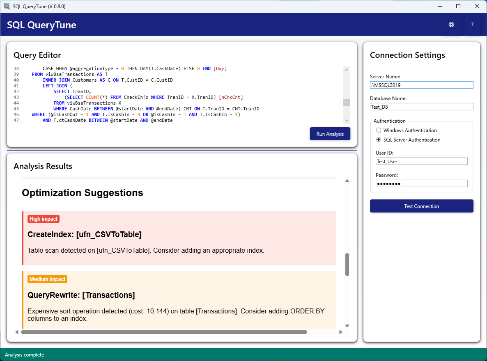

# SQL QueryTune



## Overview

SQL QueryTune is a powerful .NET tool designed to analyze SQL queries and provide optimization suggestions for Microsoft SQL Server. It performs comprehensive analysis of query execution plans, statistics, and indexing strategies to improve query performance.

> **Note**: This project is currently a work in progress. The pre-release version is usable but lacks some planned features that will be implemented in future releases.

## Features

### Currently Implemented

- **Performance Analysis**
  - Detailed performance metrics collection (CPU time, elapsed time, logical reads/writes, etc.)
  - Tracked query execution with unique identifiers for reliable metrics gathering
  
- **Execution Plan Analysis**
  - Detection of table scans
  - Identification of key lookups
  - Recognition of expensive sort operations
  - Flagging of implicit conversions

- **Index Recommendations**
  - Index suggestions based on query patterns
  - Analysis of predicate columns
  - Generation of CREATE INDEX statements

- **Statistics Analysis**
  - Statistics freshness evaluation
  - Statistics update recommendations
  - Statistics usage insights

- **Comprehensive Reporting**
  - Detailed HTML reports
  - Performance metrics visualization with explanations
  - Prioritized optimization suggestions based on impact analysis
  - Actionable recommendations with implementation guidance

- **User Interface**
  - Connection management (SQL Server and Windows authentication)
  - Query input panel with syntax highlighting
  - Results display panel for HTML reports
  - Test connection functionality

## Installation

### Prerequisites

- .NET 8.0 or later
- Microsoft SQL Server (2012 or later recommended)
- Windows 10 or later 

### Installation Steps

1. Download the latest release from the [Releases](https://github.com/yourusername/sql-querytune/releases) page
2. Extract the ZIP file to your preferred location
3. Run `SQLQueryTune.exe` to start the application

## Usage

### Basic Analysis Workflow

1. **Connect to your database**
   - Enter server name and database
   - Select authentication method (Windows or SQL Server)
   - Test your connection

2. **Enter your SQL query**
   - Type or paste your SQL query in the query panel

3. **Run analysis**
   - Click "Run Analysis" to start the optimization process

4. **Review results**
   - Review the performance metrics
   - Examine optimization suggestions
   - Implement recommended changes

### Code Example

```csharp
// Using the QueryTune.Core library programmatically
var optimizer = new SqlQueryOptimizer("connection_string");
string report = optimizer.AnalyzeAndOptimize("SELECT * FROM Users WHERE LastLoginDate > @date");
```

## Roadmap

### Planned Features

- **Query History & Management**
  - Save and recall previously analyzed queries
  - Mark frequently used queries as favorites

- **Report Export & Sharing**
  - Export to PDF/HTML
  - Copy to clipboard functionality

- **Advanced Analysis Options**
  - Batch analysis for multiple queries
  - Parameterization support
  - Customizable performance thresholds

## Technical Details

### Architecture

SQL QueryTune consists of two main components:

1. **QueryTune.Core** - A .NET library that performs the query analysis
2. **SQL QueryTune Application** - A WPF desktop application that provides a user interface

### Dependencies

- Microsoft.Data.SqlClient (v6.0.2)
- .NET 8.0 framework
- CommunityToolkit.Mvvm (for WPF application)
- Microsoft.Extensions.DependencyInjection (for WPF application)

## Contributing

Contributions are welcome! Please feel free to submit a Pull Request.

## License

This project is licensed under the MIT License.

